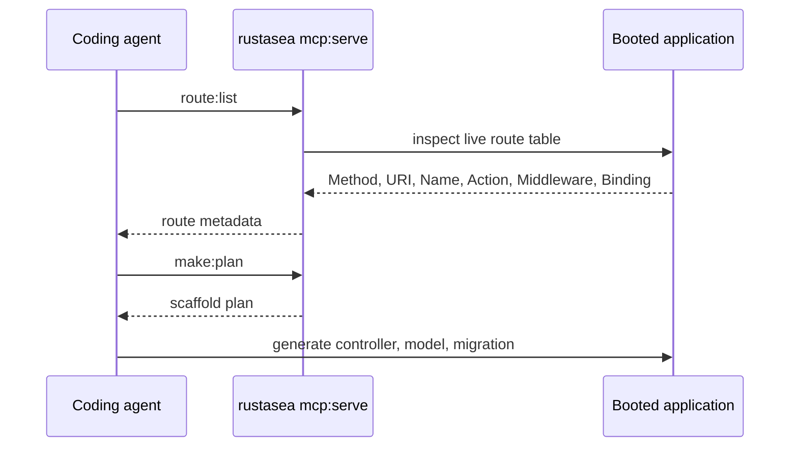

RustaSea's predictable structure and conventions make it a good fit for AI coding agents. Every project can expose its knowledge surface over the **Model Context Protocol**:

```bash
cargo artisan mcp:serve
```

This is gated behind the `ai-mcp` (or `mcp`) cargo feature on the `rustasea` crate. A build without that feature does not register the command.

## What the server exposes

The MCP server advertises tools and resources rather than raw file access.

| Tool             | Purpose                                            |
| ---------------- | -------------------------------------------------- |
| `route:list`     | The live route table                               |
| `model:show`     | Model introspection (attributes, casts, relations) |
| `make:plan`      | Scaffold planning before generation                |
| `migrate:status` | Migration state                                    |

| Resource                   | Contents                        |
| -------------------------- | ------------------------------- |
| `rustasea://docs/{name}`   | Project documentation           |
| `rustasea://config/{name}` | Configuration (values redacted) |
| `rustasea://routes`        | Route surface                   |
| `rustasea://commands`      | Registered console commands     |

## Safety boundaries

:::warning
Reads are confined to `docs/**.md` and `config/*.toml`, and config values are **redacted** before they leave the process. Nothing outside those paths is served.
:::

## Agentic development loop



## Related generators

Agent-facing scaffolds live in the same CLI:

```bash
cargo artisan make:agent {name}
cargo artisan make:tool {name}
```
