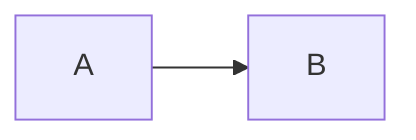

Components are **directives**, not JSX — content stays plain markdown. A few to get you started; the full reference lives at [docubook.pro/docs/components](https://www.docubook.pro/docs/components/accordion).

## Callout

```md
:::tip{title="Optional title"}
Callout content.
:::
```

Variants: `tip`, `info`, `warning`, `danger`, `success`.

## Code block with title

````md
```javascript:app.js showLineNumbers {2-3}
const docs = "markdown";
console.log(docs);
```
````

The `:filename` suffix adds a title bar; `showLineNumbers` and `{2-3}` enable line numbers and highlighting.

## Tabs

````md
::::tabs
:::tab{title="Bun"}
bun run dev
:::
:::tab{title="Node"}
npm run dev
:::
::::
````

## Card group

```md
::::cards{cols="2"}
:::card{title="First" icon="Heading1"}
Card content.
:::
:::card{title="Second" icon="Heading2"}
Card content.
:::
::::
```

## Mermaid



## Tooltip

```md
Inline :tooltip[hover me]{tip="Extra details"}.
```

## Youtube

```md
::youtube{videoId="OPM2t54T-Vo"}
```

> All directives render server-side to static HTML — no runtime JavaScript unless the component needs it.
