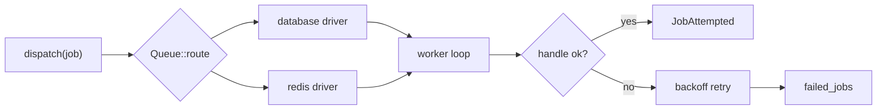

## Queues

Jobs are typed — no `any` blobs. A job implements the `Job` trait with a `handle` method, and dispatch supports `dispatch`, `dispatchSync`, `chain`, `delay`, `onQueue`, and `onConnection`.

| Area             | Capability                                                                     |
| ---------------- | ------------------------------------------------------------------------------ |
| Routing          | `Queue::route::<Job>(connection:, queue:)` central registry                    |
| Drivers          | `sync` (tests), `database`, `redis` (via `deadpool-redis`)                     |
| Policies         | `ShouldRetry`, `#[tries]`, `#[backoff]`, `#[timeout]`                          |
| Failure handling | `failed_jobs` table, `queue:failed`, `queue:retry {id}`                        |
| Batching         | Batch dispatch with completion semantics                                       |
| Metrics          | `pendingSize`, `delayedSize`, `reservedSize`, `creationTimeOfOldestPendingJob` |

```bash
cargo artisan make:job SendWelcomeEmail
cargo artisan queue:work --queue=default --max-jobs=10
```

Retries use an exponential backoff loop on `tokio::spawn` workers — no external backoff crate.

## Cache

```rust
Cache::remember("posts.featured", 3600, || async { fetch_featured().await }).await?;
```

| Operation | Methods                                                         |
| --------- | --------------------------------------------------------------- |
| Basic     | `get`, `put`, `add`, `has`, `pull`, `forget`, `flush`           |
| Lifetime  | `remember`, `forever`, **`touch`** (extend TTL without get/set) |
| Counters  | `increment`, `decrement`                                        |
| Locking   | `Lock` with atomic `get`, `block`, `release`                    |
| Stores    | `memory`, `redis`, contextual `withContext` / `store("redis")`  |

`MemoryStore` is a lock-guarded `HashMap` with TTL support. `RedisStore` is a real implementation behind the opt-in `redis` feature, with atomic `SET NX` insert-if-absent and Lua compare-and-delete lock release. Without the feature — or when Redis is unreachable — operations return a typed `StoreUnavailable` rather than panicking.

## Events and listeners

- `Event` trait plus `Listener`, where `Queue { enable: true }` makes a listener async.
- `dispatch` and `dispatchAfterResponse` cover immediate and post-response dispatch.
- Framework events include `JobAttempted { exception }` and `QueueBusy { connectionName }`.

## Scheduling

```bash
cargo artisan schedule:list --json
cargo artisan schedule:run
cargo artisan schedule:pause     # emits SchedulePaused
cargo artisan schedule:resume    # emits ScheduleResumed
```

Frequencies cover `daily`, `everyMinute`, cron expressions, `skipIfStillRunning`, and `onOneServer`. Scheduling is hand-rolled: a 5-field cron parser driven by a 60-second `tokio` ticker, with no `cron` crate dependency.



:::info
M4 is partial. Real `database` and `redis` drivers, the worker loop, DB-backed `failed_jobs`, and `schedule:*` commands are implemented. The in-process `sync` driver still keeps failed jobs in memory.
:::
