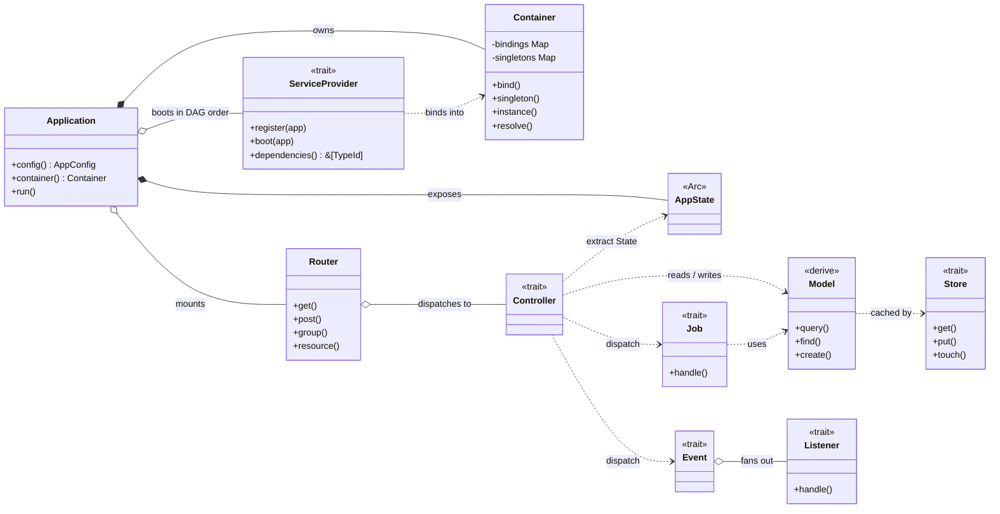

**RustaSea** is a web application framework for Rust with expressive, elegant syntax — the developer experience that made Laravel the most loved PHP framework, without sacrificing what makes Rust great.

> **Core thesis:** Laravel proves ergonomics and velocity win hearts; Rust proves safety and performance win production. RustaSea proves you can have both.

## What it ships

- A **typed routing engine** built on `axum`, with typed extractors and proc-macro attributes such as `#[middleware]` and `#[validate]`.
- A **dependency injection container** with DAG-ordered service providers and typed cycle detection.
- Multiple back-ends for **session** and **cache** storage.
- A fluent **ORM** backed by `sqlx`, with derive macros and database-agnostic migrations.
- **Background job processing** on the `tokio` runtime, with typed jobs and retry/backoff policies.
- **Real-time broadcasting** over WebSocket, SSE, Pusher, and Redis.

## Design principles

| Principle                     | Meaning                                                     |
| ----------------------------- | ----------------------------------------------------------- |
| Convention over configuration | Sensible defaults, explicit opt-out                         |
| Type safety as a feature      | Generics, lifetimes, and traits replace runtime `any` blobs |
| Zero-cost ergonomics          | Expressive APIs that compile away where possible            |
| Incremental adoption          | Use one crate or the full stack                             |

## Where to go next

- [Installation](/docs/getting-started/installation) — scaffold and boot your first application.
- [Architecture](/docs/guide/architecture) — how the crates, container, and milestones fit together.
- [AI Agents & MCP](/docs/getting-started/mcp) — expose your project to coding agents.

:::info
RustaSea is **alpha**. M2 (ORM & Database) is complete; M0, M1, and M3–M6 are partial. See [Milestones](/docs/reference/milestones) and the upstream `docs/milestones.md` for the authoritative, evidence-backed status.
:::
