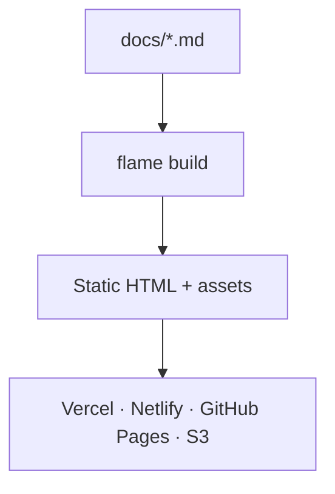

Welcome to **My Docs** — a static documentation site built with [DocuBook Flame](https://www.docubook.pro/).

Flame compiles the markdown in `docs/` into flat static HTML. No server, no database, no runtime — deploy anywhere.

